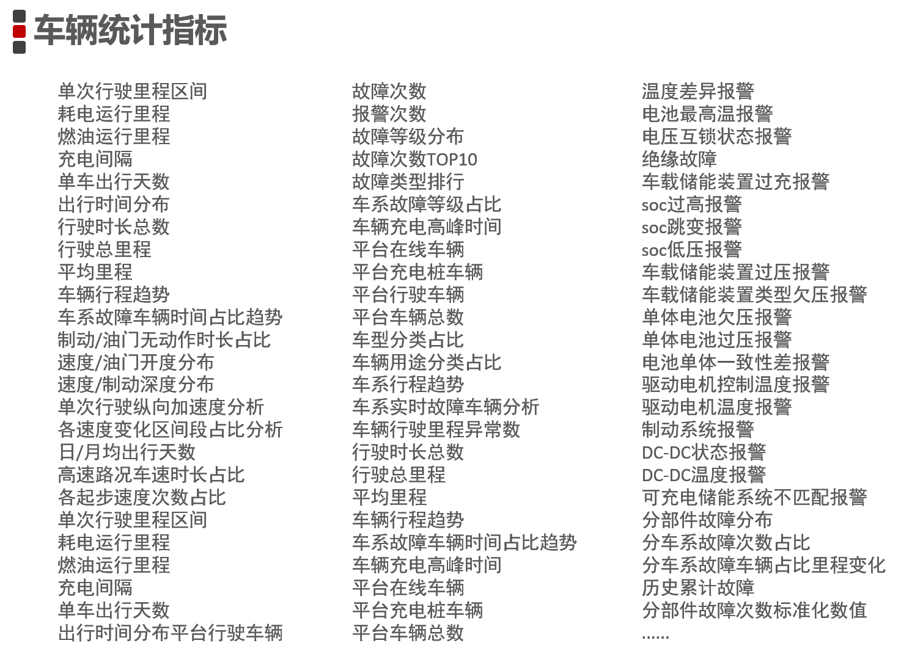
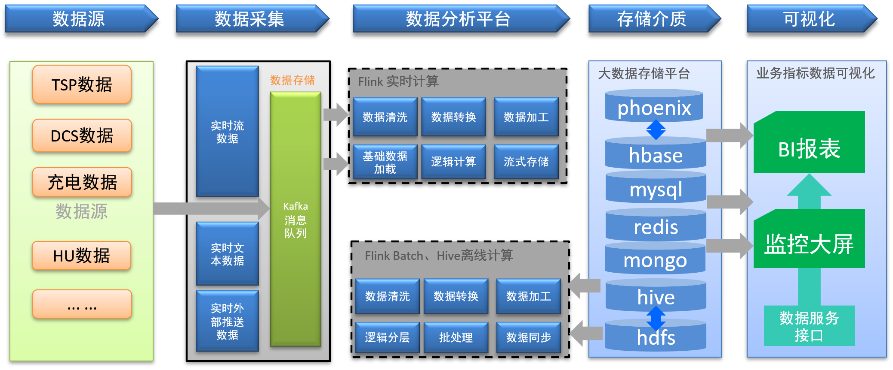
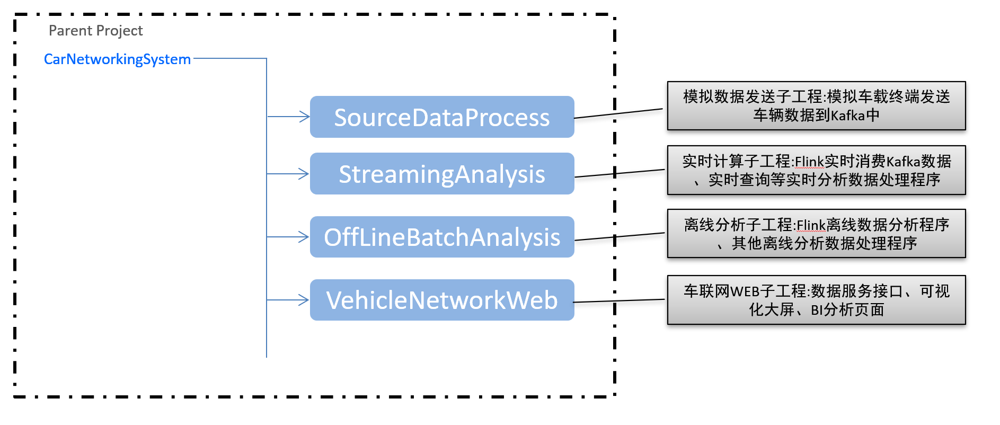
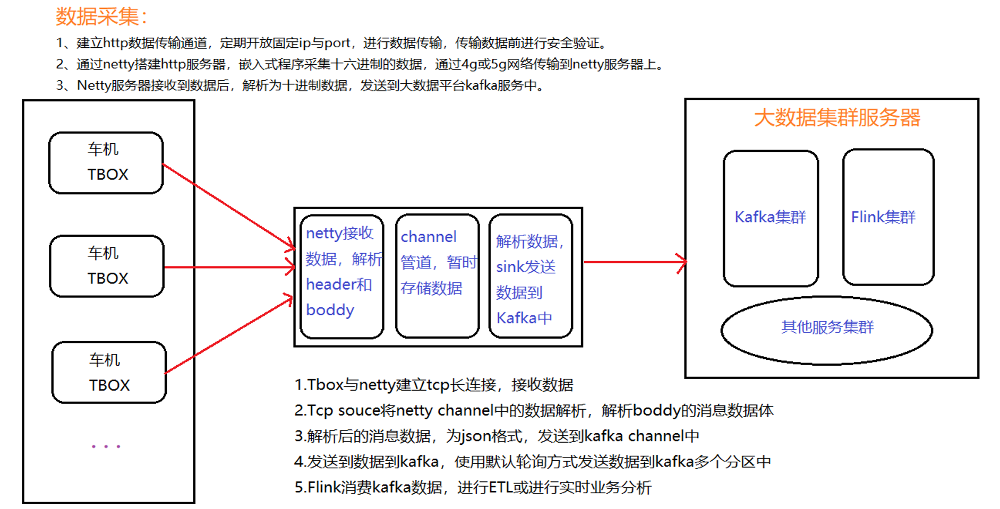
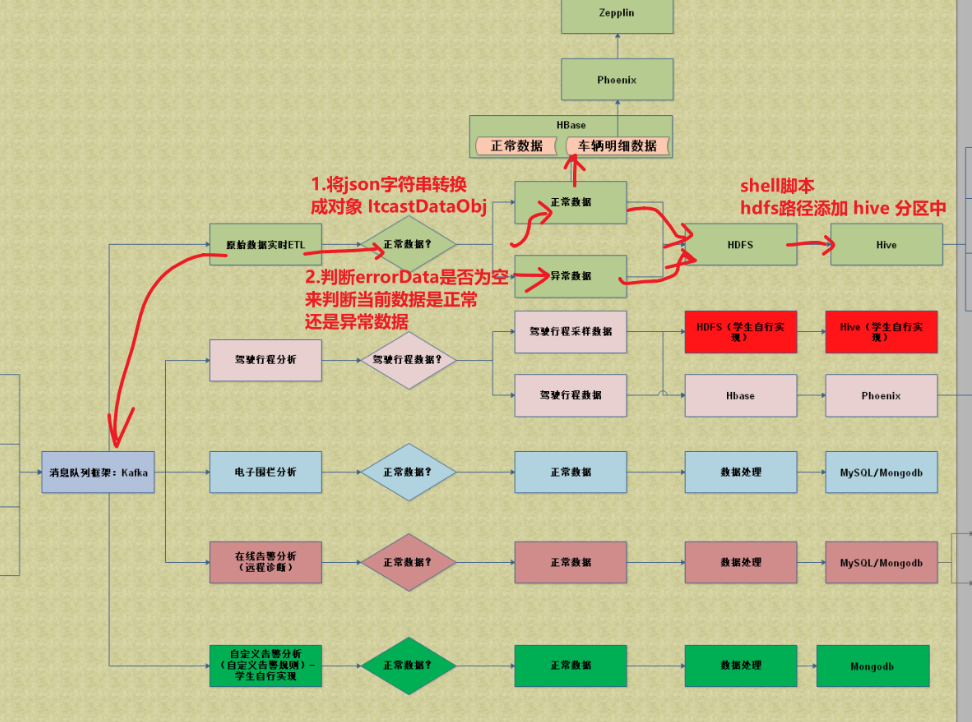
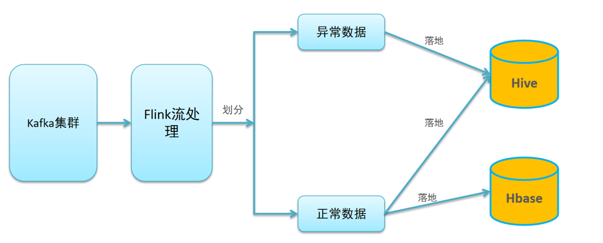

## 项目背景





Flink 流处理

kafka 消息队列

HDFS  分布式存储系统

HBase  大表存储

Phoenix  基于SQL的查询

MySQL/mongodb  存储结果数据

~~Zeppelin 前端SQL图表化~~

Dolphinscheduler  调度平台
+ 车联网项目框架搭建

  + 创建 CarNetworkingSystem 项目框架

  + 导入依赖 jar 包的版本

  + 导入配置文件 conf.properties    logback.xml

  + 创建各个模块

    | group     | artifact             | 模块               | packaging | 生成方式 |
    | --------- | -------------------- | ------------------ | --------- | -------- |
    | cn.itcast | CarNetworkingSystem  | 父工程             | pom       | 创建     |
    | cn.itcast | StreamingAnalysis    | 实时流式模块       | jar       | 创建     |
    | cn.itcast | OffLineBatchAnalysis | 离线批处理模块     | jar       | 创建     |
    | cn.itcast | SourceDataProcess    | 数据生成模拟器模块 | jar       | 创建     |
    | cn.itcast | VehicleNetworkWeb    | Web可视化模块      | war       | 导入     |

+ 实时ETL处理，对 json字符串解析

  + json字符串

    ~~~json
    "{\"batteryAlarm\": 0, \"carMode\": 1,\"minVoltageBattery\": 3.89, \"chargeStatus\": 1,\"vin\":\"LS5A3CJC0JF890971\"}"
    ~~~

  + 复杂的 key/value 和 list集合的 json字符串解析示例

```java
package cn.itcast.flink.source.test;

import org.json.JSONArray;
import org.json.JSONObject;

import java.util.ArrayList;
import java.util.HashMap;
import java.util.List;
import java.util.Set;

/**
 * 将json字符串转换成对象，将key-value转换成 HashMap
 * 对json字符串进行封装
 * 开发步骤：
 * 1.定义 json 字符串
 * 2.将JSONObject 字符串转换成 HashMap
 * 3.将JSONObject转换成 List<HashMap<String,Object>>
 * 4.解析 json 字符串
 * 5.转换成对象
 * 6.打印输出结果
 */
public class JsonPlusParseOptimize {
    public static void main(String[] args) {
        //1.定义 json 字符串
        String json = "{\"batteryAlarm\": 0,\"carMode\": 1,\"minVoltageBattery\": 3.89,\"chargeStatus\": 1,\"vin\": \"LS5A3CJC0JF890971\",\"nevChargeSystemTemperatureDtoList\": [{\"probeTemperatures\": [25, 23, 24, 21, 24, 21, 23, 21, 23, 21, 24, 21, 24, 21, 25, 21],\"chargeTemperatureProbeNum\": 16,\"childSystemNum\": 1}]}";
        //2.将JSONObject 字符串转换成 HashMap
        JSONObject jsonObject = new JSONObject(json);
        HashMap<String,Object> vehicleHashMap = toHashMap(jsonObject);
        //3.将JSONObject转换成 List<HashMap<String,Object>>
        //读取key，将字符串传递进来
        String nevChargeSystemTemperatureDtoStr = vehicleHashMap.get("nevChargeSystemTemperatureDtoList").toString();
        List<HashMap<String,Object>> lists = toList(nevChargeSystemTemperatureDtoStr);
        //4.解析 json 字符串
        //5.转换成对象
        System.out.println(Integer.parseInt(vehicleHashMap.getOrDefault("batteryAlarm",-999999).toString()));
        //6.打印输出结果
        for (HashMap<String, Object> list : lists) {
            System.out.println(list.getOrDefault("chargeTemperatureProbeNum",-999999).toString());
        }
    }

    /**
     * 将json数组字符串转换成List<HashMap>
     * @param value
     * @return
     */
    private static List<HashMap<String, Object>> toList(String value) {
        List<HashMap<String, Object>> lists = new ArrayList<>();
        JSONArray objects = new JSONArray(value);
        //遍历数组，取出所有的对象并转换成 HashMap
        for (Object object : objects) {
            String jsonStr = object.toString();
            JSONObject jsonObject = new JSONObject(jsonStr);
            lists.add(toHashMap(jsonObject));
        }
        return lists;
    }

    /**
     * 将 JSONObject 转换成 HashMap 对象
     * @param jsonObject
     * @return
     */
    private static HashMap<String, Object> toHashMap(JSONObject jsonObject) {
        HashMap<String, Object> kv = new HashMap<String,Object>();
        //读取 jsonObject 所有 keys
        Set<String> keys = jsonObject.keySet();
        for (String key : keys) {
            //遍历所有key，得到所有值
            kv.put(key,jsonObject.get(key));
        }
        //将其保存到 kv
        return kv;
    }
}
```


## Flink 将报文解析后的数据推送到 kafka 


```shell 
  1. 开启 kafka 集群
     # 三台节点都要开启 kafka 
     [root@node01 kafka]# bin/kafka-server-start.sh -daemon config/server.properties


  2. 使用 kafka tool 连接 kafka 集群，创建 topic

     # 第1种方式通过命令
     bin/kafka-topics.sh --create --zookeeper node01:2181,node02:2181,node03:2181 --topic vehicledata --replication-factor 2 --partitions 3
     # 查看 kafka topic 的列表
     bin/kafka-topics.sh --zookeeper node01:2181,node02:2181,node03:2181 --list
     # 第2种 kafka tool 工具
```


通过 flink 将解析后的报文 json 字符串推送到 kafka 中


## 实时ETL开发

+ 创建模块 —— StreamingAnalysis
+ 导入项目的 pom 依赖
+ 常见包的含义 task ， source ，sink ，entity
+ 配置文件的导入 conf.properties 和  logback.xml
+ 工具类的走读
  + 日期处理
  + 读取配置文件  静态代码块
  + 字符串常用工具 - 字符串翻转
  + JSON 字符串转对象


